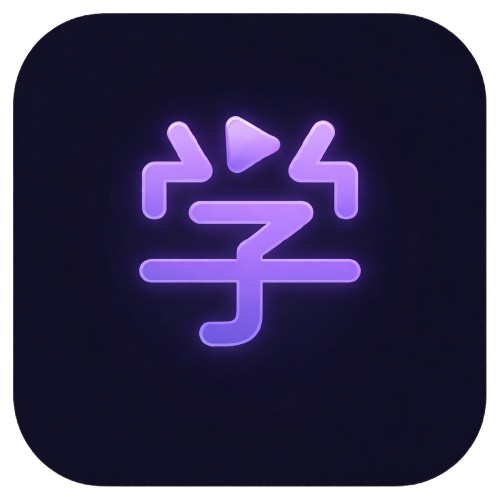
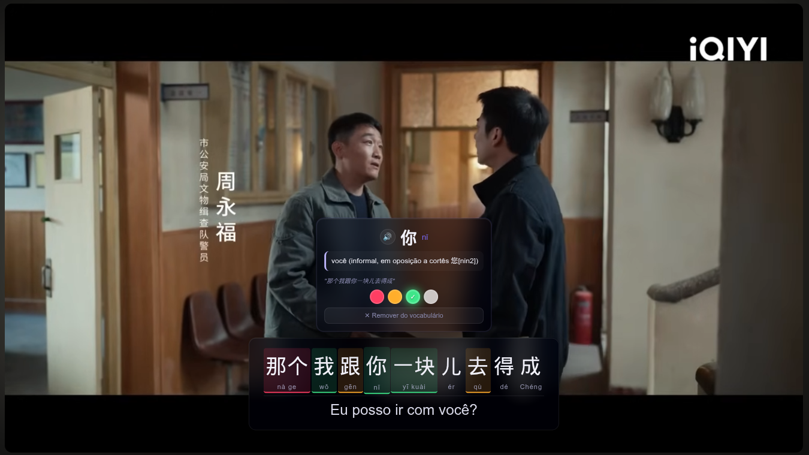
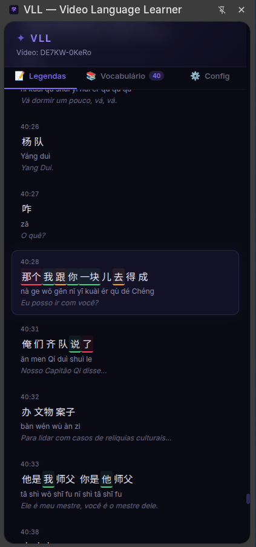
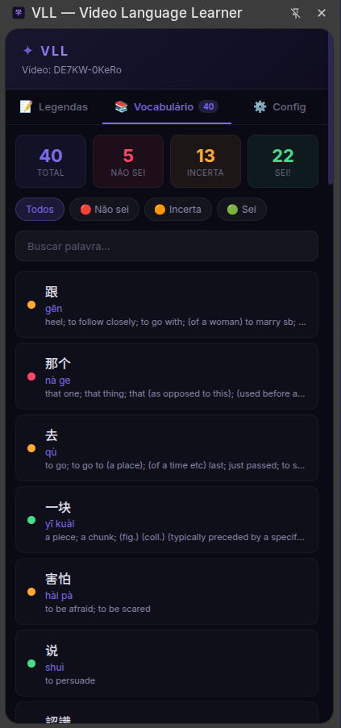
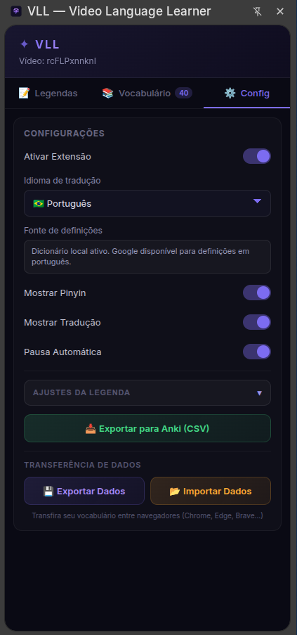
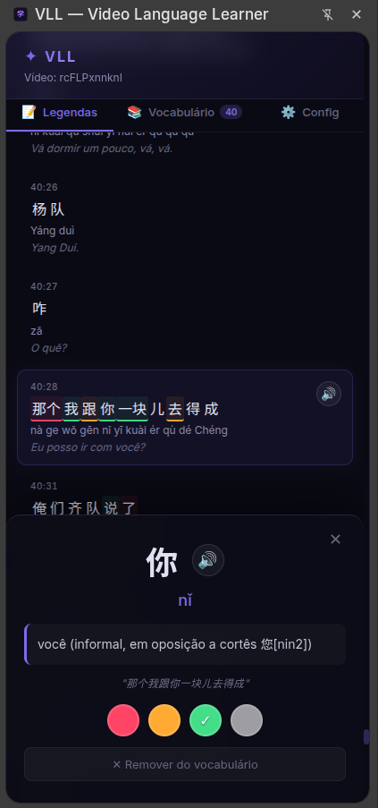
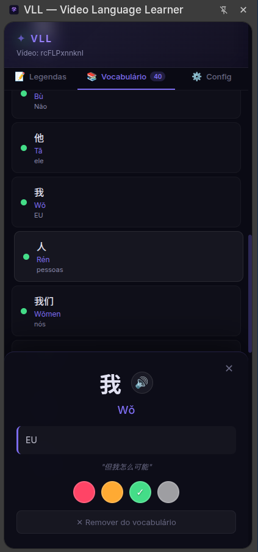
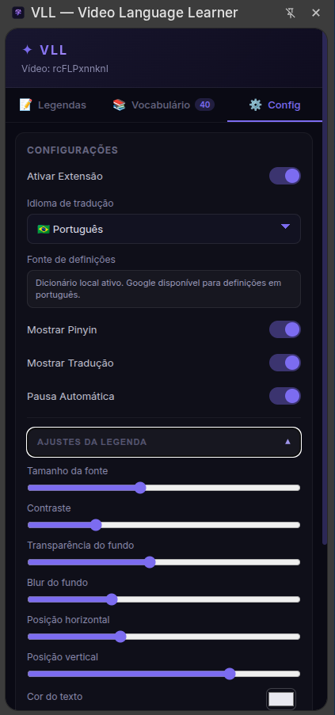
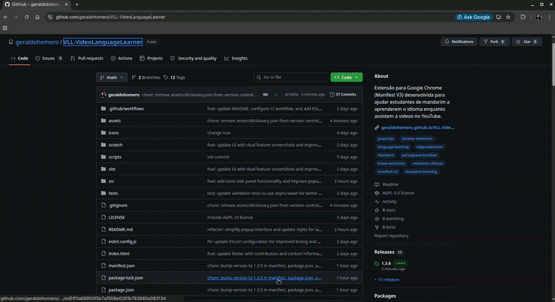
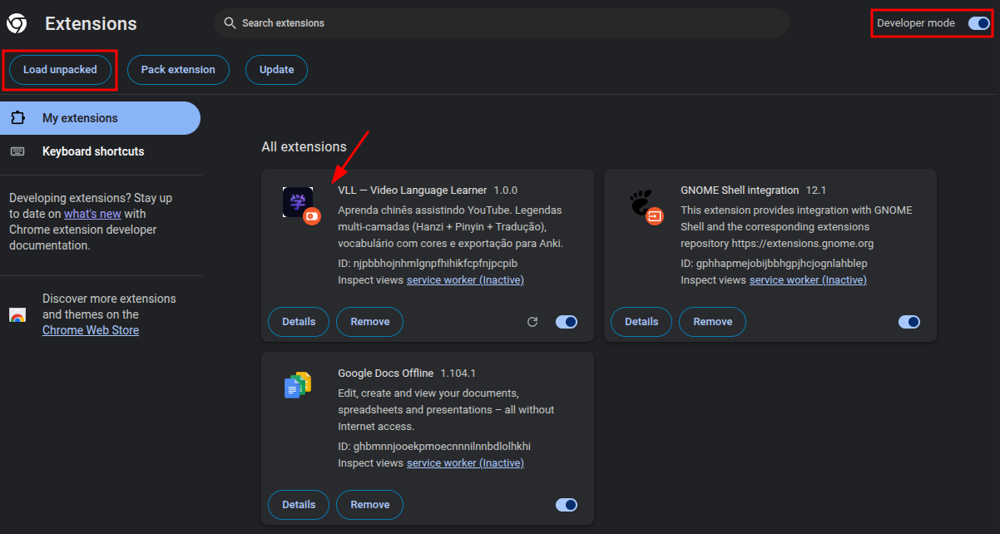

# VLL — Video Language Learner


<p align="center">
   
</p>

O **Video Language Learner (VLL)** é uma extensão para Google Chrome (Manifest V3) desenvolvida para ajudar estudantes de mandarim a aprenderem o idioma enquanto assistem a vídeos no YouTube. 

> Inicialmente projetado para falantes de Português(BR) aprenderem Chinês (Mandarim), mas poderá ser adaptado para outros idiomas no futuro

A extensão aprimora a experiência de visualização adicionando legendas interativas e personalizadas que facilitam a compreensão e a retenção de novo vocabulário.





<table style="width: 100%; border-collapse: collapse;">
   <tr>
      <td align="center" width="33%">
         <strong>Legendas</strong><br />
         
      </td>
      <td align="center" width="33%">
         <strong>Vocabulário</strong><br />
         
      </td>
      <td align="center" width="33%">
         <strong>Configurações</strong><br />
         
      </td>
   </tr>
   <tr>
      <td align="center" width="33%">
         
      </td>
      <td align="center" width="33%">
         
      </td>
      <td align="center" width="33%">
         
      </td>
   </tr>
</table>

## Como Instalar (Modo Desenvolvedor)

Como a extensão ainda está em desenvolvimento, você pode instalá-la manualmente no seu navegador:

Passo a passo:

1. [Download do arquivo zip](https://github.com/geraldohomero/VLL-VideoLanguageLearner/releases) e extraia o conteúdo do arquivo zip para uma pasta no seu computador (por exemplo, `VLL`).

2. Abra o Google Chrome e acesse a página de extensões pelo endereço:

```text
chrome://extensions/
```

3. Ative a opção **Modo do desenvolvedor** (chave no canto superior direito).
4. Clique no botão **Carregar sem compactação** (ou *Load unpacked*).
5. Selecione a pasta raiz do projeto `VLL` no seu computador.
6. Pronto! A extensão estará instalada. Fixe-a na barra de extensões para facilitar o acesso.





## Como Usar

1. Acesse o **YouTube** e `abra um vídeo que possua legendas em chinês`.
2. A extensão processará as legendas originais e renderizará automaticamente a interface multi-camadas (Hanzi, Pinyin e Tradução).
3. **Passe o mouse** sobre os caracteres para abrir o dicionário pop-up.
4. Clique no ícone da extensão para abrir o popup launcher (ativar/desativar + status) e use **Abrir painel lateral** para gerenciar vocabulário, configurações e exportações.

## Principais Recursos

- **Legendas Multi-camadas:** Exibe simultaneamente os caracteres chineses originais (Hanzi), o Pinyin (romanização) e a tradução para o Português diretamente no vídeo do YouTube.
- **Dicionário Offline Integrado:** Traduções rápidas e instantâneas sem depender de conexões de rede ou APIs instáveis.
- **Tooltip e Inspeção de Palavras:** Passe o mouse sobre os caracteres nas legendas para obter traduções, definições e detalhes do vocabulário em tempo real (Hover Tooltip).
- **Sistema de Cores para Níveis de Conhecimento:** Identifique e marque visualmente o seu nível de domínio das palavras usando um sistema prático de cores.
- **Exportação para o Anki:** Salve rapidamente novas palavras e frases que você aprendeu para revisá-las e memorizá-las de forma espaçada criando cards no Anki.
- **Painel Lateral (Side Panel) / HUD:** Uma interface amigável para gerenciar o vocabulário, preferências de exibição e interagir com o conteúdo do vídeo de modo lado-a-lado.

## Tecnologias Utilizadas

- **HTML, CSS e JavaScript (Vanilla)**
- **Chrome Extensions API:** Manipulação do DOM (`content_scripts`), processos em segundo plano (`service_worker`) e painel lateral (`side_panel`).

## Documentação

[Veja a documentação completa](./docs/docs.md)

## Contribuição

Contribuições são muito bem-vindas! Se você encontrar algum problema ou tiver uma ideia de nova funcionalidade:

1. Faça um Fork do projeto
2. Crie uma Branch para sua Feature (`git checkout -b feature/NovaFeature`)
3. Faça o Commit de suas mudanças (`git commit -m 'Adiciona Nova Feature'`)
4. Faça o Push para a Branch (`git push origin feature/NovaFeature`)
5. Abra um Pull Request

### To-do

- [x] Possibilidade de exportar e importar entre navegadores (Chrome, Edge, Brave...) 
- [ ] Adicionar suporte a mais idiomas além do Chinês (Mandarim) (Inglês, Espanhol, Francês, Japonês, Coreano, etc...). Usuário escolhe seu idioma nativo e qual língua ele quer aprender. Escolha do idioma nativo afeta língua da interface da extensão. Buscar direto essa informação no navegador? 
- [ ] Sincronização com AnkiConnect (em vez de CSV manual).

Acompanhe as [Issues](https://github.com/geraldohomero/VLL-VideoLanguageLearner/issues) e o [Projeto](https://github.com/users/geraldohomero/projects/8)
