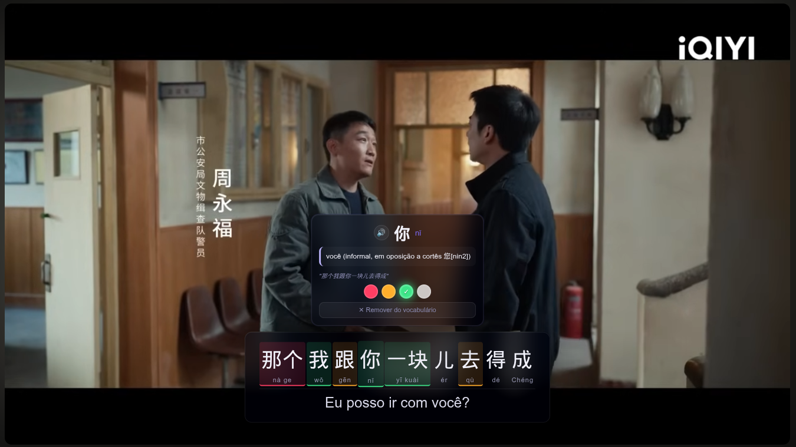
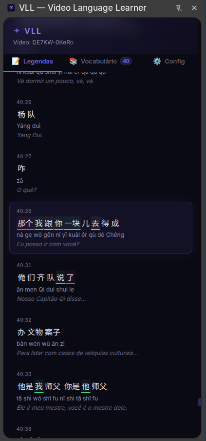
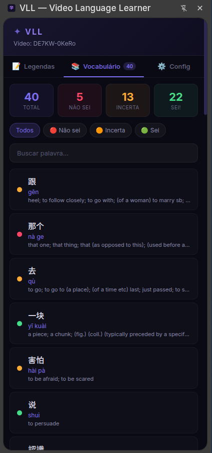
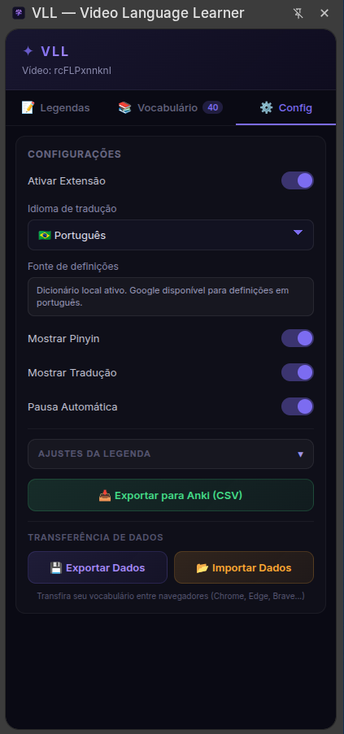
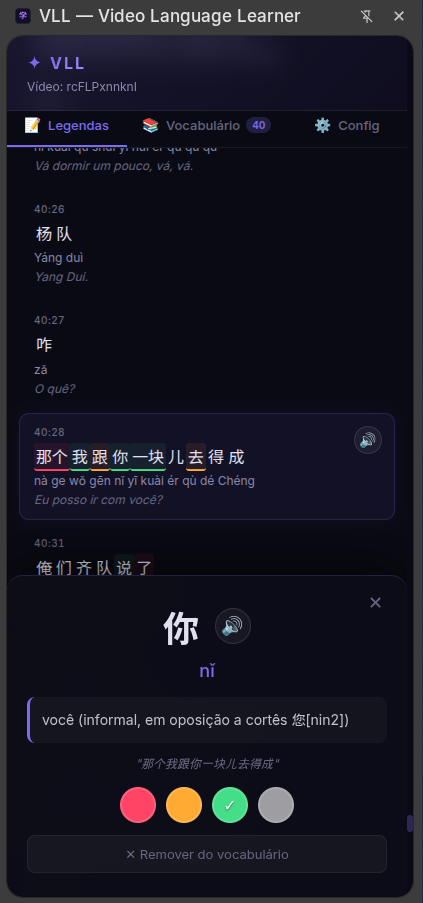
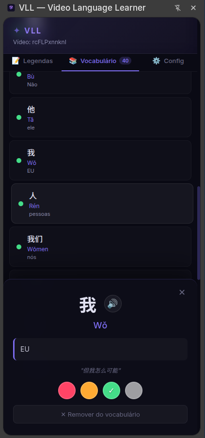
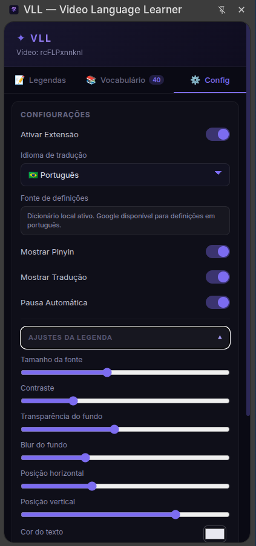
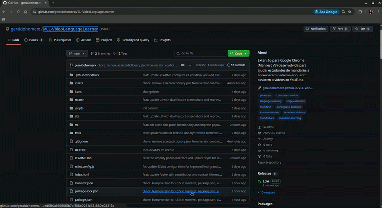
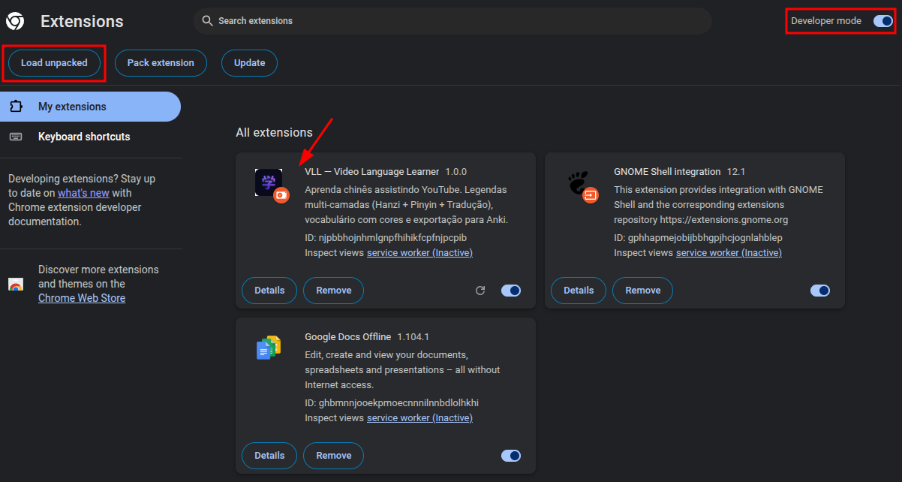

# VLL — Video Language Learner


<p align="center">
   
   <br />
   <strong>VLL — Video Language Learner</strong>
   <br />
   Aprenda mandarim no YouTube com legendas interativas, Hanzi, Pinyin e tradução.
</p>

<table align="center" width="600">
   <tr>
      <td align="center" width="50%">
         <a href="https://chromewebstore.google.com/detail/vll-%E2%80%94-video-language-lear/ogpjmaegllcpjnfmifjfnbacgonjakbi">
            
            <br />
            <strong>Google Chrome</strong>
         </a>
         <br /><br />
         <a href="https://chromewebstore.google.com/detail/vll-%E2%80%94-video-language-lear/ogpjmaegllcpjnfmifjfnbacgonjakbi">
            <strong>Instalar na Chrome Web Store ↗</strong>
         </a>
      </td>
      <td align="center" width="50%">
         <a href="https://addons.mozilla.org/pt-BR/firefox/addon/vll-video-language-learner/">
            
            <br />
            <strong>Mozilla Firefox</strong>
         </a>
         <br /><br />
         <a href="https://addons.mozilla.org/pt-BR/firefox/addon/vll-video-language-learner/">
            <strong>Instalar no Firefox Add-ons ↗</strong>
         </a>
      </td>
   </tr>
</table>


O **Video Language Learner (VLL)** é uma extensão para **Google Chrome** e **Mozilla Firefox** (Manifest V3) desenvolvida para ajudar estudantes de mandarim a aprenderem o idioma enquanto assistem a vídeos no YouTube. 

> Inicialmente projetado para falantes de Português(BR) aprenderem Chinês (Mandarim), mas poderá ser adaptado para outros idiomas no futuro

A extensão aprimora a experiência de visualização adicionando legendas interativas e personalizadas que facilitam a compreensão e a retenção de novo vocabulário.





<table style="width: 100%; border-collapse: collapse;">
   <tr>
      <td align="center" width="33%">
         <strong>Legendas</strong><br />
         
      </td>
      <td align="center" width="33%">
         <strong>Vocabulário</strong><br />
         
      </td>
      <td align="center" width="33%">
         <strong>Configurações</strong><br />
         
      </td>
   </tr>
   <tr>
      <td align="center" width="33%">
         
      </td>
      <td align="center" width="33%">
         
      </td>
      <td align="center" width="33%">
         
      </td>
   </tr>
</table>

## Como Instalar (Modo Desenvolvedor)

Como a extensão ainda está em desenvolvimento, você pode instalá-la manualmente no seu navegador:

### No Google Chrome / Navegadores Chromium

1. Abra o navegador e acesse a página de extensões pelo endereço:

```text
chrome://extensions/
```

2. Ative a opção **Modo do desenvolvedor** (chave no canto superior direito).
3. Clique no botão **Carregar sem compactação** (ou *Load unpacked*).
4. Selecione a pasta raiz do projeto no seu computador.
5. Pronto! A extensão estará instalada.





### No Mozilla Firefox

1. Abra o Firefox e acesse a página de depuração:

```text
about:debugging#/runtime/this-firefox
```

2. Clique no botão **Carregar extensão temporária...** (ou *Load Temporary Add-on...*).
3. Selecione o arquivo `.zip` em `dist/vll-video-language-learner-firefox-v1.5.0.zip` ou o `manifest.json` da pasta `dist/firefox/` (gerada via `npm run package:firefox` — sem avisos de compatibilidade com o Chrome). Você também pode carregar diretamente o `manifest.json` da raiz para desenvolvimento.
4. Pronto! A extensão estará instalada com suporte total à barra lateral (*Sidebar*) e controles.


## Como Usar

1. Acesse o **YouTube** e `abra um vídeo que possua legendas em chinês`.
2. A extensão processará as legendas originais e renderizará automaticamente a interface multi-camadas (Hanzi, Pinyin e Tradução).
3. **Passe o mouse** sobre os caracteres para abrir o dicionário pop-up.
4. Clique no ícone da extensão para abrir o popup launcher (ativar/desativar + status) e use **Abrir painel lateral** para gerenciar vocabulário, configurações e exportações.

## Principais Recursos

- **Legendas Multi-camadas:** Exibe simultaneamente os caracteres chineses originais (Hanzi), o Pinyin (romanização) e a tradução para o Português diretamente no vídeo do YouTube.
- **Dicionário Offline Integrado:** Traduções rápidas e instantâneas sem depender de conexões de rede ou APIs instáveis.
- **Tooltip e Inspeção de Palavras:** Passe o mouse sobre os caracteres nas legendas para obter traduções, definições e detalhes do vocabulário em tempo real (Hover Tooltip).
- **Sistema de Cores para Níveis de Conhecimento:** Identifique e marque visualmente o seu nível de domínio das palavras usando um sistema prático de cores.
- **Exportação para o Anki:** Salve rapidamente novas palavras e frases que você aprendeu para revisá-las e memorizá-las de forma espaçada criando cards no Anki.
- **Painel Lateral (Side Panel) / HUD:** Uma interface amigável para gerenciar o vocabulário, preferências de exibição e interagir com o conteúdo do vídeo de modo lado-a-lado.

## Tecnologias Utilizadas

- **HTML, CSS e JavaScript (Vanilla)**
- **WebExtensions API (Chrome & Firefox):** Manipulação do DOM (`content_scripts`), processos em segundo plano (`service_worker` / `background scripts`) e painel lateral (`side_panel` / `sidebar_action`).

## Documentação

[Veja a documentação completa](./docs/docs.md)

## Contribuição

Contribuições são muito bem-vindas! Se você encontrar algum problema ou tiver uma ideia de nova funcionalidade:

1. Faça um Fork do projeto
2. Crie uma Branch para sua Feature (`git checkout -b feature/NovaFeature`)
3. Faça o Commit de suas mudanças (`git commit -m 'Adiciona Nova Feature'`)
4. Faça o Push para a Branch (`git push origin feature/NovaFeature`)
5. Abra um Pull Request

### To-do

- [x] Possibilidade de exportar e importar entre navegadores (Chrome, Edge, Brave...) 
- [ ] Adicionar suporte a mais idiomas além do Chinês (Mandarim) (Inglês, Espanhol, Francês, Japonês, Coreano, etc...). Usuário escolhe seu idioma nativo e qual língua ele quer aprender. Escolha do idioma nativo afeta língua da interface da extensão. Buscar direto essa informação no navegador? 
- [ ] Sincronização com AnkiConnect (em vez de CSV manual).

Acompanhe as [Issues](https://github.com/geraldohomero/VLL-VideoLanguageLearner/issues) e o [Projeto](https://github.com/users/geraldohomero/projects/8)
