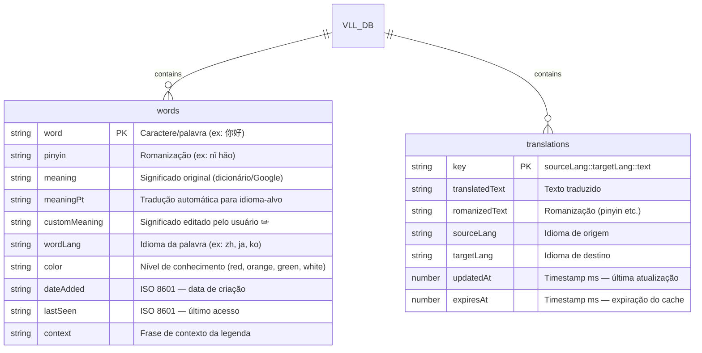
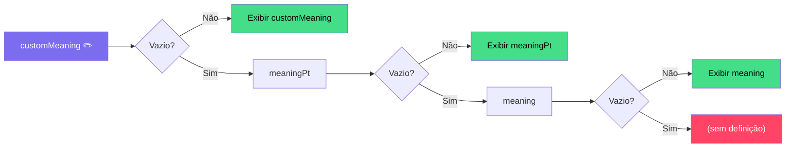

# VLL — Modelo ER do Banco de Dados (IndexedDB)

**Database:** `VLL_DB` · **Version:** `2`

## Diagrama ER

## Detalhes dos Object Stores

### `words` — Vocabulário do Usuário

| Campo | Tipo | Key/Index | Descrição |
|-------|------|-----------|-----------|
| `word` | string | 🔑 **keyPath** | Caractere ou palavra no idioma original |
| `pinyin` | string | — | Romanização (pinyin, romaji, etc.) |
| `meaning` | string | — | Significado do dicionário local ou Google |
| `meaningPt` | string | — | Tradução automática para o idioma-alvo |
| `customMeaning` | string | — | **Significado editado manualmente** pelo usuário (prioridade máxima) |
| `wordLang` | string | — | Idioma da palavra salva (ex: `zh`, `ja`, `ko`) |
| `color` | string | 📇 **index** | Nível de conhecimento: `red` / `orange` / `green` / `white` |
| `dateAdded` | string | 📇 **index** | Data de adição (ISO 8601) |
| `lastSeen` | string | 📇 **index** | Último acesso ou atualização (ISO 8601) |
| `context` | string | — | Frase da legenda onde a palavra foi encontrada |

### `translations` — Cache de Traduções

| Campo | Tipo | Key/Index | Descrição |
|-------|------|-----------|-----------|
| `key` | string | 🔑 **keyPath** | Chave composta: `sourceLang::targetLang::text` |
| `translatedText` | string | — | Resultado da tradução |
| `romanizedText` | string | — | Romanização retornada pela API |
| `sourceLang` | string | — | Idioma de origem (ex: `zh-CN`, `auto`) |
| `targetLang` | string | — | Idioma de destino (ex: `pt`, `en`) |
| `updatedAt` | number | 📇 **index** | Timestamp da última atualização |
| `expiresAt` | number | 📇 **index** | Timestamp de expiração (TTL: 30 dias) |

## Prioridade de Significados

## Operações CRUD

| Operação | Função | Store |
|----------|--------|-------|
| Criar/Atualizar palavra | `vllSaveWord(entry)` | words |
| Criar lote | `vllSaveWordsBatch(entries)` | words |
| Buscar palavra | `vllGetWord(word)` | words |
| Listar todas | `vllGetAllWords()` | words |
| Filtrar por cor | `vllGetWordsByColor(color)` | words |
| Buscar cores em lote | `vllGetWordColors(wordList)` | words |
| Atualizar cor | `vllUpdateColor(word, color)` | words |
| Atualizar significado | `vllUpdateMeaning(word, customMeaning)` | words |
| Deletar palavra | `vllDeleteWord(word)` | words |
| Ler cache tradução | `vllGetTranslationCache(key)` | translations |
| Salvar cache tradução | `vllSetTranslationCache(entry)` | translations |
| Limpar cache expirado | `vllPruneExpiredTranslationCache(limit)` | translations |
